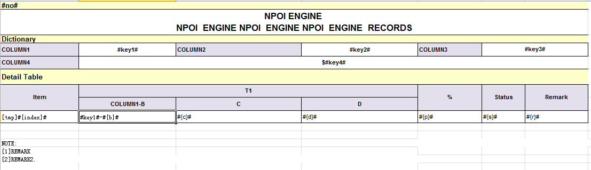
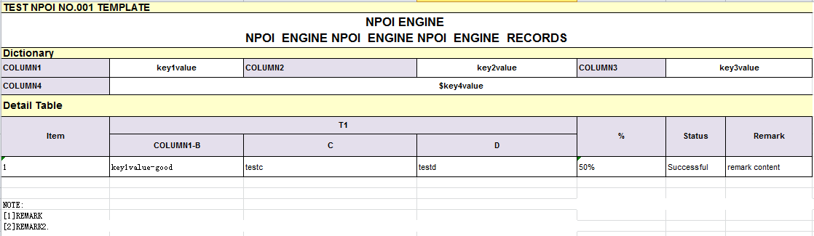

# NPOI-Template
NPOI from Template
C# 根据NPOI模版去生成复杂的EXCEL表格，标签化。可视化。只要传入字典信息等信息就可以得到自己想要的表格。免去调整NPOI格式的烦恼。NPOI 通过excel模板写入数据并导出。使用的是xlsx模版，因为npoi 导入xls模版 颜色失真 xls模版背景色有失真的问题。

C# is tagged based on the NPOI template to generate complex EXCEL forms. Visualization. As long as it is introduced into the dictionary information and other information, you can get the form you want. Avoid the trouble of adjusting the NPOI format. NPOI writes data and exports through the excel template. The xlsx template is used because the npoi import of the XLS template color distortion XLS template has the distortion of the background color.

# 说明截图

***- 可以看到#key#标签会转换成Dictionary相应值,[tmp]是固定的模版行标签,#{是嵌套子标签字段对应 子表的列名,其他功能请自己修改。 -***

You can see the #key# tag will be converted into the corresponding Dictionary value.
[tmp] is a fixed template for the label, #{is named nested label field corresponding to the sub table, please modify other functions

如需要可以发邮件laohuoye#qq.com

核心代码参考Com文件夹的NPOItemplate.cs文件，代码可以直接运行的，其他的自己可以修改

